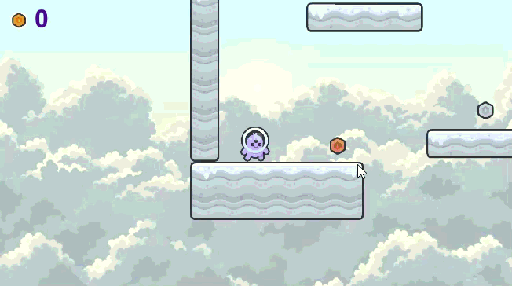

## Delivery 01 - PlatformerGame

### Description
A 2D platformer where the player collects coins, uses powerups, and navigates obstacles to reach the end of each level.

### Features
 - Jumping
 - Power Ups
 - Coins

### Controls
#### Keyboard
- Move: WASD and arrows
- Jump: Space and up arrow
- Start: Enter
- Quit: Esc

### Screenshots

### Developers

 - Alexia Martínez - Programmer, Animator
 - Arnau Badenas - Programmer
 - Carla Pallés - Programmer, Designer

### License

This game sources are licensed under MIT license. Check [LICENSE](LICENSE) for further details.

For additional licenses (art and music) see [LICENSE](Assets/LICENSES.txt).

PlatformerGame © 2026 by Alexia Martínez, Carla Pallés, Arnau Badenas
